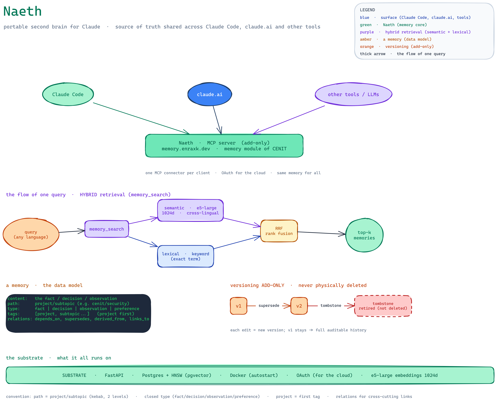

# Naeth

Portable, append-only memory for AI agents, exposed over the Model Context Protocol.

It runs in production on a single node and is used every day from Claude Code and claude.ai. Same memory, same graph, whichever client is asking.



## Why

An agent's context dies with the session. Anything worth keeping has to live outside the tool that produced it, and it has to be reachable from every tool, not just the one that wrote it. `naeth` is that store: one Postgres database, one MCP surface, any client.

Two constraints shaped the rest of the design.

**Nothing is ever destroyed.** Editing writes a new version and links it to its parent. Deleting writes a tombstone. Every claim the store has ever held can be recovered, which matters a lot when the thing writing to it is a language model.

**Authorship is recorded, not assumed.** Who wrote a note, from which surface, with which model. Some of that can be proven and some can only be taken on trust, so the schema keeps the two apart instead of flattening them into one string.

## Architecture

```
Postgres 16 + pgvector      append-only store, HNSW index, one schema owned by the module
FastAPI                     MCP server (9 tools) + local viewer and CRUD API
worker                      drains an embedding queue, writes vectors back
Svelte 5 viewer             tree, search, detail, version history
```

Auth is OAuth 2.1 / OIDC. The store is reached over MCP by agents and over a loopback-only
web viewer by me.

## The MCP surface

Nine tools, described in English with non-overlapping intent verbs so a model can pick the
right one without reading the source.

| Tool | What it does |
|---|---|
| `memory_search` | Hybrid retrieval over current memories |
| `memory_add` | Write a new memory |
| `memory_get` | Open one memory, with its full version chain |
| `memory_supersede` | Edit by writing a new version, never in place |
| `memory_tombstone` | Retire a memory without destroying it |
| `relation_add` | Link two memories with a predicate |
| `relation_list` | Neighbours of a memory, resolved across supersession |
| `relation_tombstone` | Retire a relation |
| `system_status` | Node health, queue depth, embedding model and dimension |

## Retrieval

Semantic search over pgvector with an HNSW index, fused with lexical search using
Reciprocal Rank Fusion. The embedding model is `intfloat/multilingual-e5-large` at 1024
dimensions.

It is cross-lingual on purpose: a query in English retrieves notes written in Spanish,
because e5 aligns both languages in the same embedding space. That property removed the
need to ever migrate or duplicate content by language.

## Measured, not guessed

Both benchmarks live in [`naeth/bench/`](naeth/bench) and are runnable.

**Is the index honest?** [`hnsw_check.py`](naeth/bench/hnsw_check.py) measures recall@k of
the HNSW index against exact brute-force kNN while sweeping `hnsw.ef_search`, using real
embeddings, and reports p50 and p95 latency at each setting. The spike that preceded it had
only measured latency against synthetic vectors, which proves nothing about recall.

**Does the model understand Spanish?** [`recall_es.py`](naeth/bench/recall_es.py) compares
three multilingual embedding models over a corpus of realistic notes. Every query is a
paraphrase of its own document with deliberately minimal lexical overlap, so that retrieving
the right note depends on meaning rather than on shared words. It reports recall@1, @3, @5
and MRR.

That second benchmark changed the system: it moved from
`paraphrase-multilingual-MiniLM-L12-v2` (384 dims) to `multilingual-e5-large` (1024 dims),
taking recall@1 from 0.56 to 0.80.

Numbers you cannot reproduce are opinions, so the scripts ship with the repo.

## Authorship

MCP carries no signal of which model is on the other end of the connection. Rather than
guess, every write records an `author` object whose axes are separated by how much they can
be trusted:

| Axis | Where it comes from | Trust |
|---|---|---|
| `product` | `clientInfo` in the MCP handshake | Set by the client app |
| `surface` | the endpoint the request arrived on | Set by connector config |
| `zone` | presence of an OAuth token | Derived server side |
| `actor` | MCP channel vs web viewer | Derived server side |
| `vendor`, `model` | declared by the agent itself | Taken on trust |
| `model_source` | `declared`, `undeclared` or `human` | Records which of the two applied |

The raw client payload is stored next to the normalised value, because normalisation is a
heuristic and heuristics break on clients that do not exist yet. That call paid for itself:
one client identifies itself as `Anthropic/ClaudeAI`, with no separator, which broke the
first mapping. Because the raw value had been kept, the fix was a migration rather than a
loss.

## Layout

```
naeth/app/           core, API, MCP server, embedding worker, viewer
naeth/app/tests/     pytest suite (12 tests) against an ephemeral database
naeth/bench/         the two benchmarks above
naeth/db/            schema and migrations
naeth/web/           Svelte 5 + Vite + Tailwind viewer
docs/                architecture and research notes
pasos/               the design record, one document per step
```

## Running it

This is a module, not a standalone app. Since July 2026 it runs as the `memory` module of
`cenit`, a modular self-hosted platform I maintain (private for now), and expects that core
to be up: the shared Postgres instance, the identity provider, and the network between them.
Credentials are decrypted from SOPS and injected at start, so there are none in `.env`.

```powershell
cd naeth
cp .env.example .env
.\up.ps1
```

Tests run against an ephemeral database that the fixture creates and drops:

```sh
cd naeth
docker compose --profile test run --rm test
```

The worker downloads the embedding model on first boot and caches it in a volume. Until it
finishes, search falls back to lexical only.

[`naeth/README.md`](naeth/README.md) covers the stack topology, the two surfaces and the
environment that matters.

## Writing

- [Putting an MCP server behind a real identity provider](docs/mcp-behind-a-real-idp.md).
  What I found moving identity out to a central provider: the constraint that you cannot put
  a redirect-based auth proxy in front of `/mcp`, the specification requirement I turned out
  not to have, and three things I only learned by measuring real traffic.
- [How this project kept changing its mind](docs/retrospective.md). Ten things I believed and
  then stopped believing, and what each correction cost. Includes the authorization server I
  built and then deleted.
- [Centralisation and hardening of self-hosted MCP servers](docs/mcp-auth-centralisation-research.en.md).
  A commissioned research report, kept verbatim as reference. Not my writing, and labelled as
  such.

## Design notes

`pasos/` holds the design record, one document per step, written while the system was being
built rather than reconstructed afterwards. It includes the reasoning that was later proven
wrong, which is usually the useful part. Those documents are in Spanish.

## Status

Running on a single node. Multi-node sync is the next step: `embedding` and `is_current` are
per-node and deliberately do not replicate.
