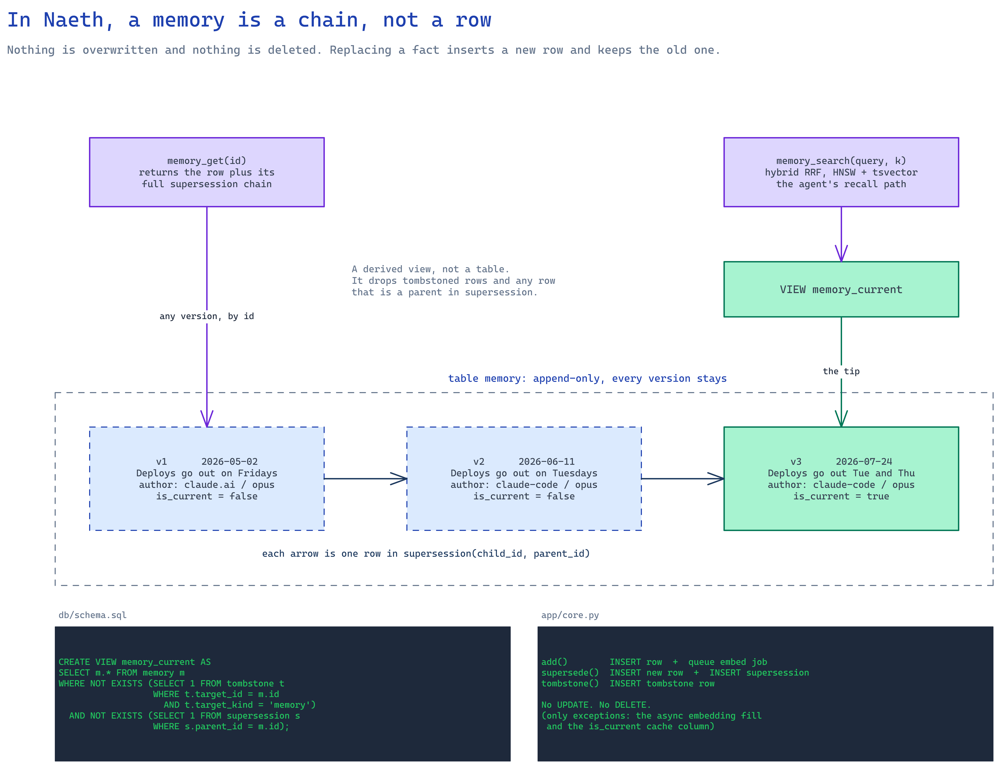
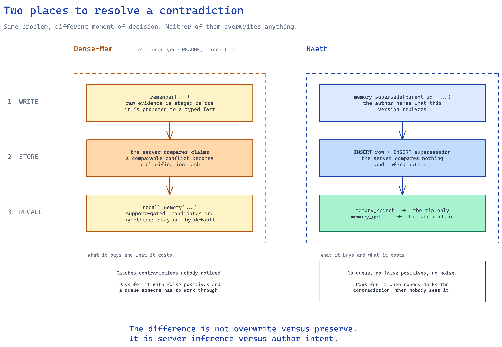
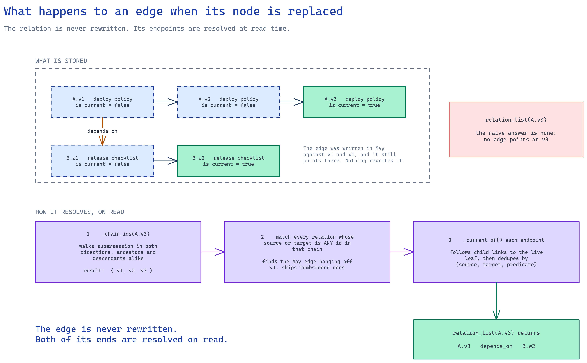

# Diagrams

Reference diagrams for how Naeth handles versioning, conflicts and relations. They were drawn to
answer questions from someone building a comparable MCP memory server, so they explain the model
from the outside in and assume no knowledge of the codebase.

Every claim in them is taken from the code. The references below are the source of truth. If the
code changes, fix the diagram or drop it.

## The diagrams

### 1. A memory is a chain, not a row

Why replacing a fact never destroys the previous one, and why the recall path and the history path
end up in different places.

- `add()`, `supersede()` and `tombstone()` are all inserts: [`app/core.py`](../../naeth/app/core.py) lines 63 to 125
- `memory_current` is a derived view, not a table: [`db/schema.sql`](../../naeth/db/schema.sql) lines 144 to 147
- Hybrid RRF search runs over that view: [`app/core.py`](../../naeth/app/core.py) line 232
- `get()` returns any row plus its supersession chain: [`app/core.py`](../../naeth/app/core.py) lines 220 to 229

### 2. Two places to resolve a contradiction

Naeth does not detect conflicts. Replacement is an explicit act by the author, so the decision
happens at write time rather than at recall time. The diagram contrasts that with a server that
infers conflicts when storing, and states the cost of both choices.

The Dense-Mem lane is read from that project's public README, not from its code. Treat it as an
outsider's summary.

### 3. What happens to an edge when its node is replaced

An edge written against v1 still points at v1 once v3 exists. Naeth treats the chain as the logical
identity of a memory and resolves both endpoints at read time, so nothing stored has to change.

- `_chain_ids()` walks supersession in both directions: [`app/core.py`](../../naeth/app/core.py) lines 144 to 160
- `_current_of()` follows child links to the live leaf: [`app/core.py`](../../naeth/app/core.py) lines 163 to 179
- `relation_list()` normalizes both endpoints and dedupes: [`app/core.py`](../../naeth/app/core.py) lines 182 to 214

## Editing them

Each `.excalidraw` opens directly at [excalidraw.com](https://excalidraw.com) and can be edited
there. That is the quickest path for a small fix.

`src/` holds the skeleton files each diagram was generated from, one JSON per band, with absolute
coordinates. They exist so a diagram can be regenerated or restyled without redrawing it by hand.
The generator that reads them lives outside this repo, so treat `src/` as an archive rather than a
build step: if it is not at hand, edit the `.excalidraw` directly and export a new PNG from
excalidraw.com.
